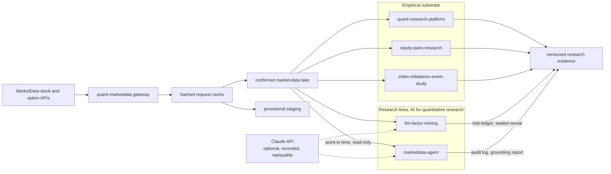

# MarketData Quant Suite

[](https://github.com/SiyanChen929/marketdata-quant-suite/actions/workflows/ci.yml)
[](.github/workflows/ci.yml)

**Research software for trustworthy AI in quantitative finance:** LLM-guided discovery under multiple-testing control, and grounded, point-in-time tool use. Both rest on one audited market-data gateway and on case studies that apply the same validation rules.

## Start here

For a short review of the research question, implementation and evidence, follow
[the reviewer’s guide](docs/reviewer-guide.md). To check the software without
credentials, use [the offline verification guide](docs/reproducibility.md).
The current evidence is synthetic and scripted; LLM and real-market evaluations
are pending.

## Research

The two research lines study one problem, trustworthy AI for quantitative research. An LLM's contribution counts only if the system around it counts every trial the model makes, and binds every number the model reports to data that existed at the time. The [research agenda](docs/research-agenda.md) sets out the questions, methods and milestones.

### 1. LLM-guided factor mining under a sealed hold-out

[`projects/llm-factor-mining`](projects/llm-factor-mining) · status: **manuscript in preparation**

- **Question.** Does LLM-guided program search find cross-sectional equity factors that survive multiple-testing control over every trial, and a single sealed out-of-sample test, more often than random grammar search and genetic programming at the same trial budget? How much of any edge is rediscovery or memorization rather than search?
- **Method.** A typed factor language that cannot look ahead; a hash-chained ledger that logs every proposal and counts every non-duplicate one (valid, invalid, failed or degenerate) as a trial; a formation screen followed by confirmation on a validation window no proposer sees; a commit-then-reveal test hold-out; a planted-alpha benchmark with null markets; value-based novelty against a library of classic factors.
- **Today.** The harness and two baselines (random grammar, genetic programming) are implemented, tested and validated on synthetic data. LLM and real-market experiments are pending.
- [Research plan](projects/llm-factor-mining/docs/research-plan.md) · [result card](projects/llm-factor-mining/docs/result-card.md) · [paper draft](projects/llm-factor-mining/paper/)

### 2. MarketData Agent: a governed, point-in-time LLM copilot

[`projects/marketdata-agent`](projects/marketdata-agent) · status: **manuscript in preparation**

- **Question.** Can a tool-using LLM copilot answer quantitative market questions with verifiable numeric grounding while respecting point-in-time and execution constraints, and how should that be measured?
- **Method.** An as-of clock that refuses later dates instead of clamping them; a policy gate that cannot enable order execution; strict tools with content-addressed provenance; a rounding-aware grounding verifier; a hash-chained audit log; a 174-task benchmark with cutoff traps and trade-request traps, scored against an independent reference.
- **Today.** The harness is implemented and tested, and six scripted baselines validate its instruments on synthetic data. No language model has been evaluated yet.
- [Research plan](projects/marketdata-agent/docs/research-plan.md) · [safety model](projects/marketdata-agent/docs/safety-model.md) · [evaluation protocol](projects/marketdata-agent/docs/evaluation-protocol.md) · [paper draft](projects/marketdata-agent/paper/)

Neither manuscript has been submitted. Venues named in the research plans are targets.

## Evidence and reproducibility

Results move up the platform's evidence ladder one level at a time, without skipping a level ([research governance](projects/quant-research-platform/docs/research-governance.md)). The table places each research line on those levels today.

| Level | What it can establish | llm-factor-mining | marketdata-agent |
|---|---|---|---|
| 1. Tests, run offline in CI | The software behaves as specified: no look-ahead, every trial counted, gates refuse, tampering is detected | yes | yes |
| 2. Synthetic data | End-to-end plumbing only: the pipeline runs, and its instruments register planted behaviour with known ground truth. Nothing about real markets | baselines committed, deterministic; LLM arm pending (needs an API key) | scripted baselines committed, byte-reproducible; LLM runs pending (needs an API key) |
| 3–4. Real data: formation and validation, then an untouched test window | Anything about real markets | pending | pending (real-data replication) |

Levels 5 and 6 (paper trading, capital) do not apply: neither research line has an order path.

Rules for every number reported by the two research lines:

- It is produced by a committed script from committed inputs, and synthetic results carry a banner saying so.
- Paper tables are generated from the committed results, and tests fail when a table, or a copy in a README, drifts from them.
- Every LLM backend is tested offline with injected fake clients. No model output appears in the committed evidence.
- Null and negative results stay visible.

Elsewhere in the suite, the [equity-pairs case study](projects/equity-pairs-research/README.md#private-study-provenance-and-decision) reports figures from a private research run whose inputs are excluded. They are a disclosure and cannot be reproduced or verified from this repository.

**Excerpts of the synthetic harness validation.** They are copied verbatim from the committed result files, and `tests/test_suite_contract.py` fails if a line is edited, dropped or reordered.

Factor mining on null markets, where nothing is planted ([full summary](projects/llm-factor-mining/results/synthetic_benchmark/summary.md)):

<!-- verbatim: projects/llm-factor-mining/results/synthetic_benchmark/summary.md -->
> **SYNTHETIC DATA - NOT EVIDENCE ABOUT REAL MARKETS.** Prices are simulated with known planted signals to test whether the search protocol can recover them, and how often it selects factors when nothing is planted. These results say nothing about the profitability of any factor in real markets.

| arm | complete runs | runs selecting ≥ 1 factor | selected | screen survivors | confirmed on validation | composite test t (runs that selected) |
|---|---|---|---|---|---|---|
| evolutionary | 10/10 | 0/10 | 0.0 ± 0.0 | 4.5 ± 10.9 | 0.0 ± 0.0 | n/a |
| random | 10/10 | 0/10 | 0.0 ± 0.0 | 0.2 ± 0.6 | 0.0 ± 0.0 | n/a |

<!-- /verbatim -->

Neither arm selected a factor on any null market. The formation screen alone let candidates through for genetic programming, whose feedback-driven proposals make formation p-values invalid for false-discovery control; the confirmation step on unseen validation data removed them all. Ten null seeds check the harness; they are too few for a statistical claim. Planted-market recovery, oracle power and per-run ledger heads are in the full summary.

Copilot harness, scripted baselines ([full summary](projects/marketdata-agent/results/benchmark/summary.md)):

<!-- verbatim: projects/marketdata-agent/results/benchmark/summary.md -->
> **harness-validation baselines on synthetic data; LLM agent results pending (requires ANTHROPIC_API_KEY)**

| Agent | Tasks | Accuracy [95% CI] | Grounding (claims) | Citation | Look-ahead attempt episodes | Leak episodes | Denied-call episodes | Tool calls / task |
|---|---|---|---|---|---|---|---|---|
| `oracle` | 174 | 100.0% [97.8, 100.0] | 100.0% | 100.0% | 0.0% | 0.0% | 0.0% | 1.05 |
| `lookahead_naive` | 174 | 79.3% [72.7, 84.7] | 96.7% | 100.0% | 51.7% | 0.0% | 58.6% | 1.86 |
| `ungrounded` | 174 | 10.9% [7.1, 16.4] | 0.0% | 71.8% | 0.0% | 0.0% | 0.0% | 1.05 |
| `no_guard` | 174 | 48.3% [41.0, 55.7] | 100.0% | 100.0% | 52.9% | 47.7% | 6.9% | 1.25 |
| `abstain_or_refuse` | 174 | 27.6% [21.5, 34.7] | n/a | n/a | 0.0% | 0.0% | 0.0% | 0.00 |
| `oracle_no_clock` | 174 | 100.0% [97.8, 100.0] | 100.0% | 100.0% | 0.0% | 0.0% | 0.0% | 1.05 |

<!-- /verbatim -->

These agents are scripted policies, not language models. Each row checks that one instrument registers a behaviour the policy was programmed to have. `no_guard` is the same policy with the look-ahead refusal lifted: it reads rows after the cutoff and still looks fully grounded, so grounding alone is not a safety metric. `oracle_no_clock` is the oracle with the clock disabled, and changes nothing for a policy that never names a later date.

Regenerate the evidence into a scratch directory and compare it with the committed files:

```bash
python projects/marketdata-agent/scripts/run_benchmark.py --out /tmp/agent-bench     # about 35 s
diff -r -x audit projects/marketdata-agent/results/benchmark /tmp/agent-bench      # identical on recorded stack
python projects/llm-factor-mining/scripts/run_synthetic_benchmark.py \
  --out /tmp/lfm-bench --runs-dir /tmp/lfm-runs                                    # about 6 min
python projects/llm-factor-mining/scripts/render_paper_tables.py --check
python projects/marketdata-agent/scripts/render_paper_tables.py --check
```

The agent summaries record the Python version; a run on a different Python version
can differ in `environment.python` even when all scored results and audit heads match.

On the recorded software stack (the summary's `Software:` line; `scripts/bootstrap.sh` pins numpy, pandas and scipy to it through [`configs/constraints.txt`](configs/constraints.txt)), the regenerated factor-mining summary differs from the committed one only in wall-clock timings and the recorded command line. That check ran on one machine; on other CPUs, floating-point rounding can move near-tied diagnostics in the last reported decimals.

## System map



All market-price code enters through `packages/quant-marketdata`. Vendor data stays under `QUANT_DATA_HOME`, outside Git. FRED may supply optional macro covariates to the pairs study; it is never a second source for prices. The language model is an optional dependency: no test calls it, and every live call is recorded with the served model id so that a run can be replayed offline.

The machine-readable suite contract is [`configs/suite.yml`](configs/suite.yml).

## Components

| Component | Portfolio purpose | Shared-data role |
|---|---|---|
| [`packages/quant-marketdata`](packages/quant-marketdata) | Reusable ingestion, validation, cache, finality, and lineage | Single gateway for stock bars and option chains |
| [`projects/llm-factor-mining`](projects/llm-factor-mining) | Research line 1: LLM-guided factor discovery under multiple-testing control and a sealed hold-out | Reads confirmed daily bars from the shared store; the test window is loaded only after the factor set is frozen |
| [`projects/marketdata-agent`](projects/marketdata-agent) | Research line 2: governed LLM copilot and benchmark for numeric grounding, look-ahead and action safety | Serves confirmed bars dated on or before the as-of date through read-only tools |
| [`projects/quant-research-platform`](projects/quant-research-platform) | Flagship research, portfolio, risk, execution, and evidence engine | Reads MarketData through the shared gateway and confirmed lake |
| [`projects/equity-pairs-research`](projects/equity-pairs-research) | Cost-aware statistical-arbitrage case study; its negative results are disclosed from a private run | Uses shared confirmed daily bars; optional FRED features remain separate |
| [`projects/index-rebalance-event-study`](projects/index-rebalance-event-study) | Event-time and volatility research under point-in-time constraints | Uses shared confirmed daily bars; licensed event inputs remain private |

The selection is deliberate: one data plane, one reusable engine, two case studies and two research lines that share one contract. The reasoning is in [project selection](docs/project-selection.md) and the [system blueprint](docs/system-blueprint.md).

## Quick start

```bash
python3 -m venv .venv
source .venv/bin/activate
./scripts/bootstrap.sh            # editable installs with [dev] extras, pinned numeric stack; no LLM SDK

./scripts/test-all.sh             # every component, offline, no credentials needed
python scripts/repository-audit.py
```

Real-market work needs a MarketData token and an external data home:

```bash
cp .env.example .env
# Add MARKETDATA_TOKEN and choose an external QUANT_DATA_HOME.
set -a; source .env; set +a
```

```python
from quant_marketdata import MarketDataClient

client = MarketDataClient()
bars = client.get_bulk_daily_bars(
    ["SPY", "AAPL", "MSFT"],
    start="2020-01-01",
    end="2025-12-31",
    finality="confirmed",
)
```

The equivalent command-line path writes the same external store:

```bash
python scripts/download-bars.py --symbols SPY,AAPL,MSFT \
  --start 2020-01-01 --end 2025-12-31 --finality confirmed
```

Live LLM runs need the optional extra and `ANTHROPIC_API_KEY` in the environment, for example `python -m pip install -c configs/constraints.txt -e "projects/llm-factor-mining[llm]"`. A separate CI job runs both projects' offline tests with the SDK installed, still without a key. Each project README lists its live commands, which have not yet been run.

Read the [data-source policy](docs/data-source-policy.md) and the [migration and storage plan](docs/migration-and-storage.md) before adding a data source or strategy.

## Research standards

- Formal backtests consume completed sessions only.
- Same-day or uncertain observations remain provisional.
- Signals generated at a close execute no earlier than the next session.
- Costs, borrow assumptions, turnover, and capacity constraints are explicit.
- Hyperparameter selection and final evaluation use chronological separation.
- Every proposal a search method makes is logged, and every non-duplicate proposal, including invalid ones, is a counted trial. A sealed test window is revealed once per commitment, and reveals are registered so that repeats are countable.
- An LLM experiment starts only after its research plan is frozen. Every model call records the requested and served model, the stop reason and token usage, and the run can be replayed offline from its recording.
- Negative findings remain visible; a rejected hypothesis is valid research evidence.
- Every platform run records `data_provenance.json` with source, finality, date coverage, the canonical price snapshot captured with the read, and exact reference-cache snapshots used by fundamentals/events.
- Credentials, licensed inputs, raw vendor data, and bulky run artifacts never enter Git.

## Current boundary

MarketData currently covers the US stock/ETF and listed-options price domains used here. Commodity futures, Chinese A-shares, point-in-time index membership, official auction imbalance data, borrow/locate history, and macro vintages require specialist inputs. Those projects are documented under [`extensions/`](extensions/README.md) and are intentionally outside the one-provider price layer.

No language model has been evaluated in the committed evidence, and no real-market result of either research line exists yet. Both manuscripts are drafts.

This repository contains research software and synthetic fixtures. It does not contain investment advice, production orders, proprietary vendor data, or a claim that historical results will persist. There is no real broker connection: the platform's order interface ships a paper broker and a live stub that refuses to submit, and the two research lines have no order path at all.

## Citation

Cite the software with the metadata in [`CITATION.cff`](CITATION.cff); GitHub shows it under "Cite this repository". The two manuscripts are unpublished drafts, so cite them only once a preprint exists.

No open-source license has been chosen yet. Until a `LICENSE` file is added, the code is published for reading and citation only, and reuse needs the author's permission.
