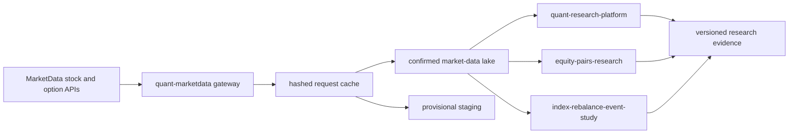

# MarketData Quant Suite

An auditable quantitative-research monorepo for US equities and listed options. The suite turns several independent research projects into one coherent system:

1. acquire market prices once through MarketData;
2. store completed and provisional sessions separately;
3. reuse one canonical OHLCV contract across every research module;
4. evaluate strategies with point-in-time, cost-aware controls; and
5. retain manifests, tests, and failure evidence suitable for review.

## System map



All market-price code must enter through `packages/quant-marketdata`. Vendor data stays under `QUANT_DATA_HOME`, outside Git. FRED may supply optional macro covariates to the pairs study; it is never a second source for prices.

The machine-readable suite contract is [`configs/suite.yml`](configs/suite.yml).

## Included work

| Component | Portfolio purpose | Shared-data role |
|---|---|---|
| `packages/quant-marketdata` | Reusable ingestion, validation, cache, finality, and lineage | Single gateway for stock bars and option chains |
| `projects/quant-research-platform` | Flagship research, portfolio, risk, execution, and evidence engine | Reads MarketData through the shared gateway and confirmed lake |
| `projects/equity-pairs-research` | Cost-aware statistical-arbitrage case study with honest negative results | Uses shared confirmed daily bars; optional FRED features remain separate |
| `projects/index-rebalance-event-study` | Event-time and volatility research under point-in-time constraints | Uses shared confirmed daily bars; licensed event inputs remain private |

The selection is deliberate. It demonstrates systems engineering, statistical research, market microstructure, disciplined validation, and intellectual honesty without publishing redundant demos or incompatible data domains.

## Quick start

```bash
python3 -m venv .venv
source .venv/bin/activate
./scripts/bootstrap.sh

cp .env.example .env
# Add MARKETDATA_TOKEN and choose an external QUANT_DATA_HOME.
set -a; source .env; set +a

./scripts/test-all.sh
python scripts/repository-audit.py
```

Example data access:

```python
from quant_marketdata import MarketDataClient

client = MarketDataClient()
bars = client.get_bulk_daily_bars(
    ["SPY", "AAPL", "MSFT"],
    start="2020-01-01",
    end="2025-12-31",
    finality="confirmed",
)
```

The equivalent command-line path writes the same external store:

```bash
python scripts/download-bars.py --symbols SPY,AAPL,MSFT \
  --start 2020-01-01 --end 2025-12-31 --finality confirmed
```

See [the system blueprint](docs/system-blueprint.md), [data-source policy](docs/data-source-policy.md), [migration and storage plan](docs/migration-and-storage.md), and [project selection](docs/project-selection.md) before adding another strategy.

## Research standards

- Formal backtests consume completed sessions only.
- Same-day or uncertain observations remain provisional.
- Signals generated at a close execute no earlier than the next session.
- Costs, borrow assumptions, turnover, and capacity constraints are explicit.
- Hyperparameter selection and final evaluation use chronological separation.
- Negative findings remain visible; a rejected hypothesis is valid research evidence.
- Every platform run records `data_provenance.json` with source, finality, date coverage, the canonical price snapshot captured with the read, and exact reference-cache snapshots used by fundamentals/events.
- Credentials, licensed inputs, raw vendor data, and bulky run artifacts never enter Git.

## Current boundary

MarketData currently covers the US stock/ETF and listed-options price domains used here. Commodity futures, Chinese A-shares, point-in-time index membership, official auction imbalance data, borrow/locate history, and macro vintages require specialist inputs. Those projects are documented under [`extensions/`](extensions/README.md) and are intentionally outside the one-provider price layer.

This repository contains research software and synthetic fixtures. It does not contain investment advice, production orders, proprietary vendor data, or a claim that historical results will persist.
