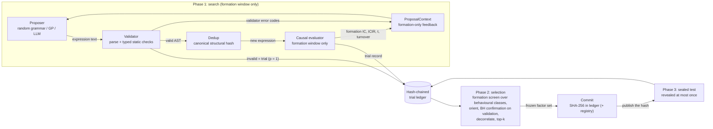

# LLM-guided factor mining under a sealed-holdout protocol

> **Status: research in progress.** The search harness, baselines and protocol
> are implemented and tested. The only results so far come from a **synthetic**
> benchmark that checks the harness works. **LLM results and real-market
> results are pending.** No live LLM experiment has been run, and nothing here
> is evidence that any factor earns returns in real markets.

## Research question

Large language models can write formulaic alpha expressions and give an
economic story for each one. A model trained on the finance literature may
also remember which signals worked, and when. This project asks two questions.
First, **does LLM-guided program search find cross-sectional equity factors
that survive (i) multiple-testing control over every trial it made and (ii) a
single sealed out-of-sample evaluation more often than random grammar search
and genetic programming with the same trial budget?** Second, **how much of
any advantage comes from rediscovering known factors, or from look-ahead
through pre-training data, rather than from search?** The repository provides
the measurement apparatus:

- a typed factor language that cannot look ahead by construction;
- an interface that gives proposers formation-window statistics only;
- a hash-chained ledger that counts every trial;
- a two-stage multiplicity procedure: a formation screen over behaviourally
  distinct hypotheses, then a confirmatory test on a validation window no
  proposer has seen;
- a commit-then-reveal test hold-out with a project-wide reveal register;
- contamination diagnostics, including value-based novelty against a library
  of classic factors;
- a planted-alpha benchmark with known ground truth and null markets.

The full plan is in [`docs/research-plan.md`](docs/research-plan.md) and the
paper draft is in [`paper/`](paper/).

## Architecture



| Stage | Module |
|---|---|
| Factor language: 8 terminals, 27 operators, parser, validator, canonical hashing | `src/llm_factor_mining/dsl/` |
| Confirmed daily panels read through `quant_marketdata` | `src/llm_factor_mining/data.py` |
| Causal evaluator, rank IC, Newey-West t, quantile and long-short metrics | `src/llm_factor_mining/evaluate/` |
| Proposers: random grammar (A), genetic programming (B), LLM with record/replay | `src/llm_factor_mining/proposers/` |
| Splits and embargo, trial ledger, sealed hold-out, study registry, contamination checks | `src/llm_factor_mining/protocol/` |
| BH / BY / Holm, deflated Sharpe ratio | `src/llm_factor_mining/inference.py` |
| Search, two-stage selection and seal loop | `src/llm_factor_mining/search.py` |
| Synthetic planted-alpha benchmark and the pre-registered draw of one planted signal | `src/llm_factor_mining/benchmark/` |

## Leakage and multiplicity controls

Each control is implemented in code and covered by an offline test. The
last column says what the control does *not* guarantee.

| Control | Mechanism | Test | Limits |
|---|---|---|---|
| Causal language | Operators only look backward. Windows are integer literals (`delay`/`delta` need d >= 1, rolling operators d >= 2). Forward returns are not a terminal. | `test_lookahead.py` changes all bars after a date and checks that no earlier factor value moves, for every operator, terminal and nested expressions | none known |
| Execution lag and embargo | `fwd[t] = close[t+lag+h] / close[t+lag] - 1` with `lag >= 1` enforced. Windows are separated by at least `lag + max_horizon` sessions and each window drops its last `lag + h` signal dates. | `test_metrics.py`, `test_protocol.py` | |
| Phase-by-phase data access | The search loop evaluates on a panel cut at the formation end; validation data enter only after the loop. With a loader (the store path) later windows are not even loaded until their phase, and the test window is loaded only after the factor set is frozen. | `test_search.py` (`test_loader_reads_each_window_only_when_its_phase_starts`) | With an in-memory panel (synthetic data) the whole history is in the process: the barrier is the interface. In-process code could read memory; an LLM receives nothing but the rendered prompt. |
| Formation-only feedback | `ProposalContext` is frozen and slotted, and its feedback fields accept exactly two types, whose metric fields are all `formation_*`. Anything else raises `LeakageError`. | `test_proposer_isolation.py`: every context is identical when post-formation data are altered | |
| Windows fixed before evaluation | `evaluate` cannot move windows: synthetic markets use the fixed default split, and store data use the windows registered for a *study* (`register-study`); the panel is never loaded past the registered validation end, and every `evaluate` call is logged in the registry's exploration count. | `test_cli_stage2.py` | The registry is self-attested (see below). |
| Anonymized prompts | The context carries no dates, tickers or sample sizes. Harness-written prompt text is checked for ISO dates, month names (full names; "March", "May" and abbreviations when capitalized), four-digit years and panel symbols; a hit aborts the run. Model-written rejected text that trips the check is redacted instead. | `test_llm_backend.py` | Heuristic: feedback statistics are not checked for year-like numbers, and distributional fingerprints of a period cannot be detected. |
| Trial ledger | An append-only, SHA-256 hash-chained JSONL file. Every processed proposal is a trial: evaluated, invalid, failed or *degenerate* (too few dates with a defined IC). | `test_protocol.py` (tamper detection, concurrent writers), `test_search.py` | Self-attested: it detects accidental or naive edits. Anyone with write access can rebuild the chain; a head hash proves something to a third party only once it is published elsewhere before the reveal. |
| Two-stage multiplicity | (1) Formation screen: BH over behavioural classes (trials whose per-date ranks agree up to sign test one hypothesis), m = budget minus behavioural duplicates, so an early stop never shrinks the family. Degenerate trials count in m with p = 1. (2) Confirmation: BH on one-sided validation p-values of the screened candidates, m = candidates. p-values use t(n - 1). | `test_search.py`, the null markets of the benchmark | Formation p-values of feedback-driven proposers are not valid for FDR control; only the confirmation step is. Near-duplicates that are not rank-identical stay separate hypotheses (BH then relies on positive dependence; BY is available). |
| Sealed hold-out | A commitment over the factor set, metric settings, test window and data hash is written before any test metric exists. One commitment and one reveal per (data hash, test window) and ledger, whatever the metric settings; the ledger is re-read on every call. Store data are only *committed* by `search`; `reveal` is a separate step that needs the published commitment hash and the registry's permission (a pre-registered maximum number of reveals per study). | `test_protocol.py`, `test_cli_stage2.py` | The register makes repeated reveals countable, not impossible. |
| Knowledge-cutoff split | Test IC is compared before and after a provider-documented training cutoff. Returns that straddle the cutoff are dropped. The cutoff date is never assumed. A library function, not yet wired into run artifacts. | `test_protocol.py` | |
| Record/replay LLM calls | Every outcome of every call, failures included, is appended in order to a write-only JSONL file keyed by request and backend identity; replay follows the recorded path exactly. Transient errors (429, 5xx, 529, connection) are retried with bounded backoff; configuration errors (400/401/403/404/413/422) abort the run. The served model id, stop reason and token usage are logged. Server-side fallback is off by default. | `test_llm_backend.py` (including a live-then-replay run with a transient failure) | A new live run is a new sample. |

The main residual risks are listed under [Status](#status) and in the
[research plan](docs/research-plan.md#7-threats-to-validity).

## Quickstart

Run these from the repository root with the suite environment active. Every
command below was run successfully on 2026-09-25.

```bash
export PYTHONDONTWRITEBYTECODE=1
export PYTHONPATH=packages/quant-marketdata/src:projects/llm-factor-mining/src

# offline test suite (under a minute)
python -m pytest -q -p no:cacheprovider projects/llm-factor-mining/tests

# the factor language
python -m llm_factor_mining.cli grammar
python -m llm_factor_mining.cli validate "cs_rank(-ts_std(returns, 20))"
python -m llm_factor_mining.cli library

# score one expression on the formation window of a synthetic market
python -m llm_factor_mining.cli evaluate "-ts_mean(returns, 5)" --data synthetic --seed 0 --snr 0.15

# one full search -> select -> commit -> reveal run on synthetic data (a run directory is required)
python -m llm_factor_mining.cli search --proposer evolutionary --data synthetic --snr 0.15 --seed 0 \
  --budget 100 --run-dir projects/llm-factor-mining/runs/demo-evolutionary

# the two-step form: commit only, publish the printed commitment hash, then reveal once
python -m llm_factor_mining.cli search --proposer random --data synthetic --snr 0.15 --seed 0 \
  --budget 100 --no-reveal --run-dir projects/llm-factor-mining/runs/demo-two-step
python -m llm_factor_mining.cli reveal --run-dir projects/llm-factor-mining/runs/demo-two-step \
  --commitment <commitment hash printed by the previous command>
```

Each run directory holds exactly one ledger, so use a new directory for each
run. It gets these files:

- `config.json`: configuration, splits, data hash, how the data were loaded
- `ledger.jsonl`: every trial, duplicate, proposer error, the selection, the commitment and the reveal
- `selected.json`: the frozen set, the commitment and the selection funnel
- `reveal.json`: test metrics (only after a reveal)
- `provenance.json`: data hash, software versions, proposer provenance (served models, token usage), ledger heads

To check the ledger against the head hash recorded in the run's provenance:

```bash
python - <<'EOF'
import json
from llm_factor_mining.protocol import verify_ledger_file
run = "projects/llm-factor-mining/runs/demo-evolutionary"
head = json.load(open(f"{run}/provenance.json"))["ledger_head"]
records = verify_ledger_file(f"{run}/ledger.jsonl", expected_head=head)
print(len(records), "records verified; head", head[:12])
EOF
```

`runs/` is gitignored. To run the tests from the project directory instead:
`cd projects/llm-factor-mining && PYTHONDONTWRITEBYTECODE=1 PYTHONPATH=src:../../packages/quant-marketdata/src python -m pytest -q -p no:cacheprovider`.

### Real market data (pending)

Real-market evaluation reads confirmed daily bars from the suite's external
store. It needs `QUANT_DATA_HOME`, filled beforehand through `quant_marketdata`
(see the [root README](../../README.md)). The flow below was checked only
against a scratch store filled with synthetic bars (`test_cli_stage2.py`). No
real-market result exists yet.

```bash
REGISTRY=/path/outside/the/repo/study-registry.jsonl
# 1. fix the windows (and the number of reveals) before evaluating anything
python -m llm_factor_mining.cli register-study --registry "$REGISTRY" --study u1 \
  --symbols SYMBOL1,SYMBOL2,... --start YYYY-MM-DD --end YYYY-MM-DD --max-reveals 1
# 2. exploration on formation/validation only; every call is counted
python -m llm_factor_mining.cli evaluate "cs_rank(-ts_std(returns, 20))" --data store \
  --registry "$REGISTRY" --study u1
# 3. search and commit (store data are never revealed here)
python -m llm_factor_mining.cli search --proposer random --data store --registry "$REGISTRY" --study u1 \
  --run-dir runs/u1-random
# 4. publish the commitment hash outside this repository, then reveal once
python -m llm_factor_mining.cli reveal --run-dir runs/u1-random --commitment <hash> --registry "$REGISTRY"
```

### LLM arm (requires credentials; not yet executed)

No API key was available when these results were produced, so **none of the
commands in this subsection has been run against the live API.** The backend
is covered by offline tests with an injected fake client
(`test_llm_backend.py`, and the LLM paths in `test_search.py` and
`test_benchmark.py`).

- The default model id is `claude-opus-5`, with adaptive thinking and effort
  `high`; the prompt templates are version `v2`.
- The backend never sends sampling parameters, and `--max-tokens` is capped at
  21,333 because the backend does not stream.
- Every outcome of every call is recorded to a fresh `llm_responses.jsonl`, so
  the run can be replayed offline along exactly the same path.

```bash
export ANTHROPIC_API_KEY=...   # environment only; never committed
python -m llm_factor_mining.cli search --proposer llm --backend anthropic --effort high \
  --data synthetic --snr 0.15 --seed 0 --run-dir projects/llm-factor-mining/runs/demo-llm
# exact offline replay of the recorded responses (no network)
python -m llm_factor_mining.cli search --proposer llm --backend replay \
  --replay-file projects/llm-factor-mining/runs/demo-llm/llm_responses.jsonl \
  --data synthetic --snr 0.15 --seed 0 --run-dir projects/llm-factor-mining/runs/demo-llm-replay
# LLM arm of the synthetic benchmark
python projects/llm-factor-mining/scripts/run_synthetic_benchmark.py --backend anthropic
```

`--fallback` enables server-side model fallback. It is off by default because
it can change the model under test. Without credentials, `--backend anthropic`
stops before creating a run directory, and the benchmark records the LLM arm
as "not run".

## Synthetic benchmark (harness validation only)

> **SYNTHETIC DATA - NOT EVIDENCE ABOUT REAL MARKETS.** These numbers test
> whether the search protocol can recover signals that were planted in
> simulated prices, and how often it selects anything when nothing is
> planted. They say nothing about any factor's profitability in real
> markets. The LLM arm was not run.

**Simulation.** 60 fictional symbols × 750 sessions. The simulated returns
contain four equal-weight planted signals, which pay off only after the
one-session execution lag:

- two `textbook` signals: 5-day reversal and 20-day abnormal volume;
- one `library_family` signal, `-ts_corr(returns, delta(log(volume), 1), 10)`:
  the volume–return correlation idea behind Kakushadze's Alpha#2, whose
  formula is in the reference library;
- one `drawn` signal, `delta(ts_cov(ts_argmin(low,20),cs_demean(open),5),1)`:
  candidate 40 of a pre-registered random draw from the typed grammar, the
  first one whose values are far from every library entry
  ([`results/planted_signal_draw.json`](results/planted_signal_draw.json)).

Every planted signal can be produced by both baselines (a test computes a
non-zero sampling probability under the random grammar).

**Grid.** SNR 0.05 and 0.15 with market seeds 0 to 2, plus 10 *null*
markets (snr = 0, seeds 0 to 9) in which nothing is planted.

**Protocol.**

- Budget of 200 trials per run.
- Formation screen: BH at 0.10 over behavioural classes, m = budget minus
  behavioural duplicates.
- Confirmation: BH at 0.10 on one-sided validation p-values of the screened
  candidates.
- Validation ICIR ranking, then decorrelation at |rho| < 0.7, keeping the top 5.
- One sealed test reveal.

The tables are copied verbatim from
[`results/synthetic_benchmark/summary.md`](results/synthetic_benchmark/summary.md).

| SNR | arm | complete runs | recovery | recall | selected | true FDP | test non-sig. rate | composite test IC | composite test ICIR | behavioural novelty | structural novelty |
|---|---|---|---|---|---|---|---|---|---|---|---|
| 0.05 | evolutionary | 3/3 | 0.08 ± 0.14 | 0.42 ± 0.14 | 1.3 ± 2.3 | 0.00 | 0.50 | 0.0224 | 0.162 | 0.38 | 0.88 |
| 0.05 | random | 3/3 | 0.00 ± 0.00 | 0.42 ± 0.14 | 0.3 ± 0.6 | 0.00 | 0.00 | 0.0186 | 0.131 | 0.59 | 0.86 |
| 0.15 | evolutionary | 3/3 | 0.33 ± 0.14 | 0.50 ± 0.00 | 5.0 ± 0.0 | 0.00 ± 0.00 | 0.00 ± 0.00 | 0.0762 ± 0.0126 | 0.581 ± 0.074 | 0.27 ± 0.07 | 0.85 ± 0.02 |
| 0.15 | random | 3/3 | 0.33 ± 0.14 | 0.42 ± 0.14 | 5.0 ± 0.0 | 0.00 ± 0.00 | 0.13 ± 0.12 | 0.0677 ± 0.0040 | 0.540 ± 0.050 | 0.35 ± 0.08 | 0.82 ± 0.05 |

| SNR | arm | reversal_5 | abnormal_volume_20 | volume_return_corr_10 | drawn_40 |
|---|---|---|---|---|---|
| 0.05 | evolutionary | 0/3 selected, 3/3 found | 1/3 selected, 2/3 found | 0/3 selected, 0/3 found | 0/3 selected, 0/3 found |
| 0.05 | random | 0/3 selected, 3/3 found | 0/3 selected, 2/3 found | 0/3 selected, 0/3 found | 0/3 selected, 0/3 found |
| 0.15 | evolutionary | 2/3 selected, 3/3 found | 2/3 selected, 3/3 found | 0/3 selected, 0/3 found | 0/3 selected, 0/3 found |
| 0.15 | random | 2/3 selected, 3/3 found | 2/3 selected, 2/3 found | 0/3 selected, 0/3 found | 0/3 selected, 0/3 found |

| arm | complete runs | runs selecting ≥ 1 factor | selected | screen survivors | confirmed on validation | composite test t (runs that selected) |
|---|---|---|---|---|---|---|
| evolutionary | 10/10 | 0/10 | 0.0 ± 0.0 | 4.5 ± 10.9 | 0.0 ± 0.0 | n/a |
| random | 10/10 | 0/10 | 0.0 ± 0.0 | 0.2 ± 0.6 | 0.0 ± 0.0 | n/a |

**Metric definitions.**

- **recovery**: share of planted signals matched by a selected, oriented
  factor (rho >= 0.7 on the test window; signed, so a factor that bets
  against a planted signal recovers nothing).
- **recall**: |rho| >= 0.7 for any evaluated trial on the formation window.
- **true FDP**: share of selected factors whose oriented rank correlation
  with the planted composite (the true expected-return signal) on the test
  window is below 0.1. On null markets every selected factor would count as
  false.
- **test non-significance rate**: share of selected factors whose one-sided
  test IC fails BH at 0.05. It measures the power of a 148-date test window,
  not falsity.
- **behavioural novelty**: 1 − max |mean per-date rank correlation| with any
  library factor on the formation window (0 = a re-spelled library factor).
  **Structural novelty** (1 − max subtree Jaccard similarity) describes
  syntax only and is secondary.
- Statistics of selected factors average only the runs that selected
  something; a value without ± comes from one run.

**What these synthetic results show.** Each planted cell has only 3 seeds and
the null arm 10, so none of the differences below is a statistical claim.

- **The confirmation step is what controls false selections.** On the null
  markets neither arm selected anything in 10 runs. The formation screen
  alone was not safe for the feedback-driven arm: genetic programming passed
  4.5 ± 10.9 expressions through it on null data (35 in one run, per the
  funnel table in `summary.md`), random search 0.2 ± 0.6. GP chooses its next
  expressions from formation results, so its formation p-values are not
  valid for FDR control.
- **At SNR 0.05 the protocol has little power.** Only one run per arm
  selected anything. The oracle's own planted composite has test t
  statistics of 4.65 to 4.90, but individual planted signals are weaker and
  the 147-date validation window rarely confirms a candidate.
- **At SNR 0.15 both arms selected five factors with a true FDP of 0.00.**
  Composite test IC was 0.0762 ± 0.0126 for GP and 0.0677 ± 0.0040 for
  random search, against 0.1333 to 0.1445 for the planted composite.
- **Neither arm found the `library_family` or the `drawn` signal**, in any
  of the 12 planted runs, although both are in their search space. Only the
  textbook signals were recovered.
- **Syntax-based novelty is misleading.** At SNR 0.15 the selected factors
  look new to the structural (subtree) score, 0.85 ± 0.02 (GP) and
  0.82 ± 0.05 (random), but their values are close to library factors:
  behavioural novelty was 0.27 ± 0.07 and 0.35 ± 0.08. Rediscovery has to be
  measured on values.
- **Behavioural duplicates are common.** Each run produced 12 to 61
  evaluated trials whose ranks repeated an earlier trial's (funnel table).
  Counted separately, such clusters would inflate BH discoveries.

## Status

**Implemented and tested.** The offline test suite runs in under a minute with
no network access. It covers:

- the typed DSL: parser, validator with structured error codes, and canonical
  hashing that treats argument order of commutative operators as equal;
- the causal evaluator (property-tested for no look-ahead);
- IC, Newey-West, quantile and cost-adjusted long-short metrics;
- the confirmed-only panel built through `quant_marketdata`;
- the random-grammar and genetic-programming baselines, and the sampling
  probability of any tree under the random grammar;
- the LLM proposer and Claude backend: structured JSON output, refusal,
  `max_tokens` and `pause_turn` handling, retries, fatal configuration
  errors, record/replay with failures, served-model logging, prompt
  redaction;
- the formation-only context and the phase-by-phase loader;
- chronological splits with embargo, the hash-chained ledger, the sealed
  hold-out and the study registry;
- BH/BY/Holm, the deflated Sharpe ratio and the two-stage selection;
- the synthetic benchmark (planted and null markets) and the CLI, including
  the two-step commit/reveal flow on a scratch store;
- checks that the paper's generated tables and the quoted tables match the
  committed results.

**Pending (not yet done):**

- live LLM runs (synthetic benchmark arm, then real data);
- real-market evaluation on confirmed MarketData bars (universe
  construction, data-quality report, cost sensitivity);
- the classic-library baseline (C), a compute-matched baseline arm (the
  benchmark supports `name@budget` arms, none has been run) and the ablation
  wrappers (feedback off, rationale off, anonymization probe);
- bootstrap tests: White's Reality Check, Hansen's SPA, Romano–Wolf, and the
  date-level block bootstrap that H1 and H3 of the plan use;
- wiring the knowledge-cutoff split into run artifacts;
- drawdown and trade-count metrics.

**Known simplifications:**

- Newey-West t-statistics are referred to a t distribution with n − 1
  degrees of freedom, a conservative convention rather than an exact result.
- The deflated Sharpe ratio is a diagnostic on formation |ICIR|, with 2N
  trials for the two-sided selection and independent trials assumed.
- Behavioural deduplication merges only trials with identical per-date ranks.
  Highly correlated variants remain separate hypotheses.
- Returns are close-to-close from the stored bars. Whether dividends are
  included depends on the provider's adjustment, and this must be verified
  before real-data claims.

## Reproduce the synthetic benchmark

```bash
python projects/llm-factor-mining/scripts/draw_planted_signal.py
python projects/llm-factor-mining/scripts/run_synthetic_benchmark.py
python projects/llm-factor-mining/scripts/render_paper_tables.py --check
```

The first command re-runs the pre-registered draw and checks that it still
accepts the planted `drawn_40` expression. The second rewrites
`results/synthetic_benchmark/summary.{json,md}` and writes per-run ledgers to
`runs/synthetic_benchmark/` (gitignored). The run is deterministic: on
2026-09-25, re-running four of its runs (SNR 0.05 seed 2 and null seed 0,
both arms) with a different `PYTHONHASHSEED` reproduced their ledger heads and
every scored field.

- The recorded runtime is 332.8 s.
- Software: Python 3.11.15, numpy 2.4.6, pandas 2.3.3, scipy 1.17.1.
- Each run's ledger head hash is listed in `summary.md`, so any run can be
  checked record by record.

The third command confirms that the paper's tables (`paper/tables/*.tex`)
were generated from the committed summary.

## Repository layout

```text
src/llm_factor_mining/   package (dsl, data, evaluate, proposers, protocol, inference, search, benchmark, cli)
src/llm_factor_mining/prompts/   versioned prompt templates (SHA-256 recorded on every call)
scripts/                 draw_planted_signal.py, run_synthetic_benchmark.py, render_paper_tables.py
results/                 committed, small, synthetic-only result summaries and the planted-signal draw
docs/                    research-plan.md, result-card.md
paper/                   LaTeX draft (make -C paper), tables generated from results/
tests/                   offline pytest suite (helpers in lfm_helpers.py)
```

## Documents

- [`docs/research-plan.md`](docs/research-plan.md): research questions,
  falsifiable hypotheses, protocol, ablations, threats to validity, budget and
  timeline.
- [`docs/result-card.md`](docs/result-card.md): the suite's minimum result
  card for the synthetic benchmark, plus a blank card for real-data runs.
- [`paper/`](paper/): manuscript skeleton. Results sections that need LLM or
  real-market evidence are explicit TODOs.
  - Build it with `make -C projects/llm-factor-mining/paper`, which needs a
    TeX distribution with `latexmk`.
  - No TeX engine was available where this repository was prepared, so the
    PDF build has not been run. `tests/test_paper_tables.py` checks the
    structure instead: citations, cross-references, inputs and generated
    macros all resolve, and the tables match the results.

## Scope and disclaimer

- **Data rules.** Market prices enter only through the suite's
  `quant_marketdata` gateway, and formal evaluation uses `finality="confirmed"`
  bars only. No credentials, vendor data or run artifacts are committed.
- **Not investment advice.** This is research software. It places no orders
  and gives no investment advice.
- **No submission.** No paper has been submitted or accepted, and the venues
  in the research plan are targets.
