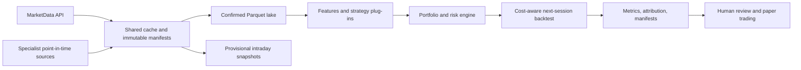

# Quant Research Platform

A point-in-time, execution-aware research platform for US equities and listed options. Within the MarketData Quant Suite it consumes the shared `quant_marketdata` gateway and external data home, then connects strategy research, portfolio construction, risk controls, backtesting, experiment evidence, and paper-trading review through explicit interfaces.

The project is designed to make attractive but invalid results difficult to publish. Close-generated signals execute no earlier than the next session, costs and borrow are charged, data quality can block trading, and optimization is separated from validation and forward evaluation.

## Architecture



See [architecture](docs/architecture.md), [data contract](docs/data-contract.md), and [research governance](docs/research-governance.md).

## What is implemented

- MarketData daily, intraday, earnings/event, fundamentals, and option-chain adapters.
- Canonical OHLCV validation plus a DuckDB/partitioned-Parquet research lake.
- Cross-sectional momentum, breakout/retest, trend, and optional mean-reversion signals.
- Exposure, drawdown, event, gap, liquidity, crowding, and position-size controls.
- Next-session execution, slippage, commission, borrow, turnover, and capacity costs.
- Walk-forward splits, coarse parameter searches, stability diagnostics, attribution, and experiment registries.
- Paper-trading plans, pretrade checks, monitoring, and explicit live-order confirmation gates.
- A broad offline test suite covering point-in-time behavior, execution timing, risk, data quality, and provider normalization.

## Offline quick start

```bash
python3 -m venv .venv
source .venv/bin/activate
python -m pip install -e "../../packages/quant-marketdata[dev]"
python -m pip install -e ".[dev]"

quant-platform backtest --config configs/default.yml
quant-platform report --run-id latest
python -m pytest -q
```

The repository already includes deterministic synthetic price fixtures through
`2026-05-06`; the default workflow reads them without rewriting tracked files.
It proves the software path and is not market-performance evidence. The
`download` command is a maintainer-only fixture-regeneration step and is not
required for this quick start.

## MarketData workflow

Keep vendor data outside the Git repository:

```bash
export MARKETDATA_TOKEN="your-token"
export QUANT_DATA_HOME="/absolute/path/to/quant-data"

quant-platform download --config configs/marketdata.yml
quant-platform update-market-data --config configs/marketdata.yml --through YYYY-MM-DD
quant-platform build-lake --config configs/marketdata.yml --daily-only
quant-platform audit-data --config configs/marketdata.yml --out runs/data-audit
```

`update-market-data` caps formal daily updates at the latest completed US equity session. Intraday downloads write a separately named provisional daily view and do not mutate confirmed-close history.

## Research contract

- A signal computed after session `t` closes can execute no earlier than session `t+1`.
- Formal backtests use confirmed closes only.
- Intraday or uncertain observations remain provisional and carry a quote timestamp.
- Fundamentals, events, constituents, and corporate actions need point-in-time availability fields.
- Every result should identify its data cutoff, configuration, costs, code version, and validation period.
- MarketData results include the canonical price-manifest snapshot plus exact earnings/event/fundamental cache manifests consumed by the run.
- Backtests are research artifacts, not expected-return claims or investment advice.

## Project layout

```text
src/quant_system/
  data/           providers, validation, lake, audit, maintenance
  strategies/     signal plug-ins
  portfolio/      construction and risk controls
  backtest/       execution, costs, metrics, attribution, reports
  optimization/   walk-forward and robustness workflows
  live/           paper/live gates and monitoring
configs/          offline and MarketData examples
data/sample/      small synthetic fixtures only
tests/            point-in-time and systems tests
```

## Scope and limitations

MarketData is the default provider for supported US securities and listed options. It does not replace point-in-time index membership, borrow/locate history, official auction prints, licensed macro vintages, agricultural/weather data, or China-specific market structure. Those remain specialist adapters with separate provenance.

Daily bars cannot reproduce queue position, exact bid/ask execution, halts, locate availability, or market impact. Public results should emphasize process quality, robustness, and failure analysis rather than the best historical metric.
